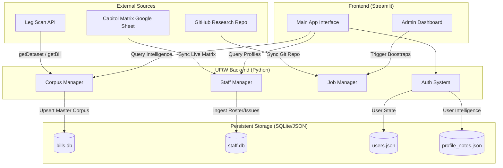

# 🏛️ Unfuck The World (UFtW) Bill Tracker

The UFtW Bill Tracker is a high-performance legislative intelligence platform designed to bridge the gap between official bill data and community action. It provides a multi-user, profile-driven experience for tracking and analyzing California and Federal legislation.

## 🚀 Mission
To provide advocates, policy wonks, and active citizens with the tools to "unfuck the world" by making complex legislative data transparent, searchable, and actionable.

---

## 🗺️ Technical Architecture (Tech Map)

The system is built as a multi-layered Python application using **Streamlit** for the frontend, **SQLite** for performance-indexed data, and **LegiScan API** for official source data.



---

## 🛠️ Key Components

### 1. Master Bill Corpus (`corpus_manager.py`)
- **Layer A Architecture**: Syncs the *entire* legislative session to a local SQLite database (`bills.db`).
- **Performance**: Instant full-text searching across thousands of bills without hitting API rate limits during browsing.
- **Incremental Refresh**: Automatically checks for `change_hash` updates to keep local records current.

### 2. Staff & Issue Intelligence (`staff_manager.py`)
- **Capitol Matrix Integration**: Ingests live Google Sheets containing staff rosters, issue assignments, and committee leadership.
- **Relational Linking**: Cross-references staff names against the bill corpus to identify lobbyists or consultants associated with specific bills.

### 3. Multi-User Authentication (`auth.py`)
- **Self-Service Registration**: Anyone can create an account to start tracking.
- **Privacy**: Tracked bills, saved views, and internal notes are isolated per user.
- **Admin Control**: System administrators can manage users and trigger global data syncs.

### 4. Background Job Management (`job_manager.py`)
- **Job Decoupling**: Large data operations (like "Bootstrapping" 20k+ bills) run in the background with a visual progress tracker.
- **Automation**: Includes support for cron-based weekly syncs.

---

## 🏁 Quick Start

### 1. Prerequisites
- Python 3.10+
- A LegiScan API Key ([Get one here](https://legiscan.com/legiscan))

### 2. Installation
```bash
git clone https://github.com/mattcallaway/legiscan_private.git
cd legiscan_private
pip install -r requirements.txt
```

### 3. Configuration
Create a `config.json` in the root directory:
```json
{
  "repo_dir": "./research",
  "data_dir": "./data",
  "api_key": "YOUR_LEGISCAN_API_KEY"
}
```

### 4. Run the App
```bash
streamlit run legiscan_git_sync_update_8_7.py
```

---

## 📋 Administration
1. **Bootstrap**: Go to **Admin Tools** and run a "Bulk Bootstrap" for the current session (e.g., CA 2023-2024).
2. **Staff Sync**: Run "Sync Live Capitol Matrix" to ingest the latest staff roster.
3. **People Mapping**: Use the "Auto-Map" tool to link LegiScan IDs to your local staff database for voting history accuracy.

---
*Created by the UFtW Team to empower legislative transparency.*